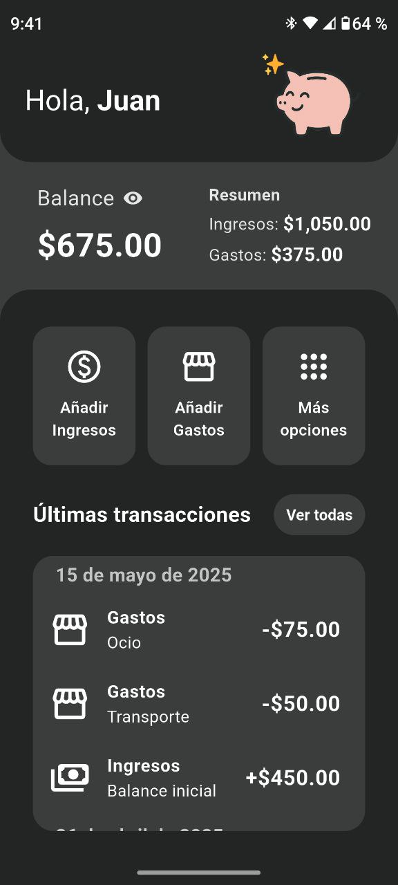
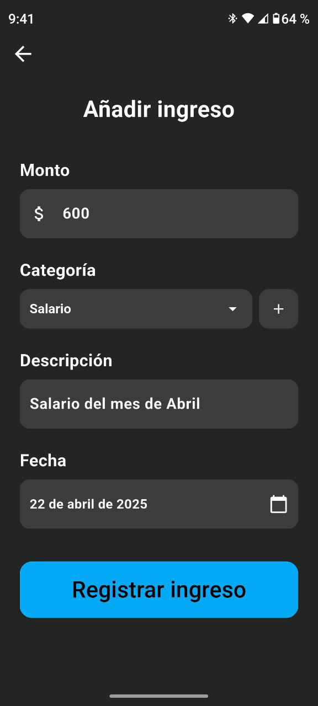
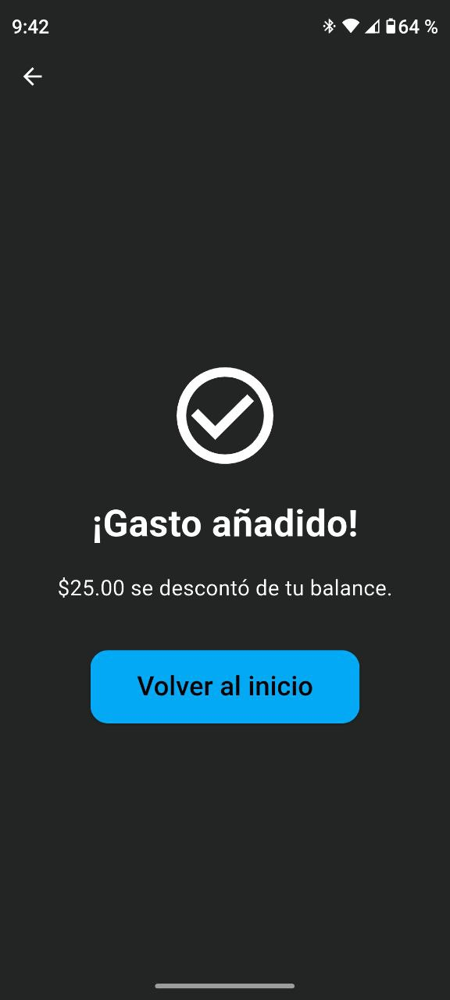
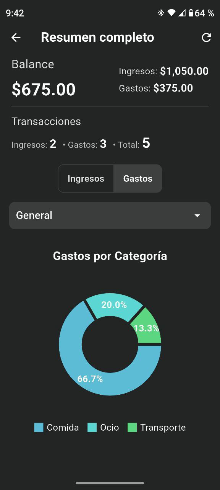

# Zave
Zave es una aplicación de finanzas personales desarrollada con Flutter que te permite llevar un control detallado de tus ingresos, gastos, y deudas. Diseñada para ser intuitiva, visual y eficiente.

## Características

- Registro de ingresos y gastos con categorías personalizadas
- Visualización de gráficos para análisis financiero
- Filtros por fecha: hoy, semana, mes, últimos 6 meses y vista general
- Gestión de deudas con pagos parciales y estado de pago
- Almacenamiento local con SQLite y shared_preferences
- Resplado de datos en la nube con Google Firebase

## Capturas de pantalla

  
  
  

  
  
  

## Tecnologías utilizadas

- Flutter
- SQFlite (SQLite para Flutter)
- Shared Preferences
- Firebase (Google services)
- Flutter Charts (como fl_chart)
- SVGs y diseño responsive

## Cómo ejecutar el proyecto

1- Clona este repositorio:

`git clone https://github.com/kevinD14/Zave.git`

2- Entra al directorio del proyecto:

`cd zave`

3- Instala las dependencias:

`flutter pub get`

4- Ejecuta la app:

`flutter run`

Importante: Para que la app funcione correctamente con Firebase, necesitas añadir el archivo google-services.json en la ruta android/app/ de tu proyecto.
Este archivo no está incluido en el repositorio por razones de seguridad.
Obténlo desde tu consola de Firebase y colócalo en la carpeta mencionada.
